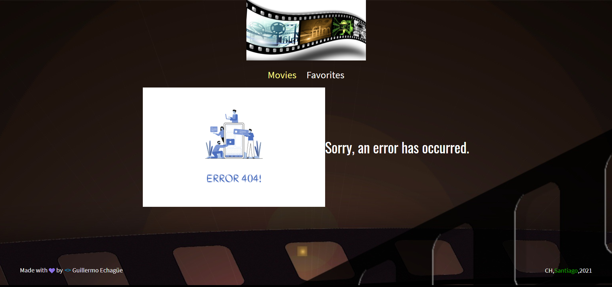
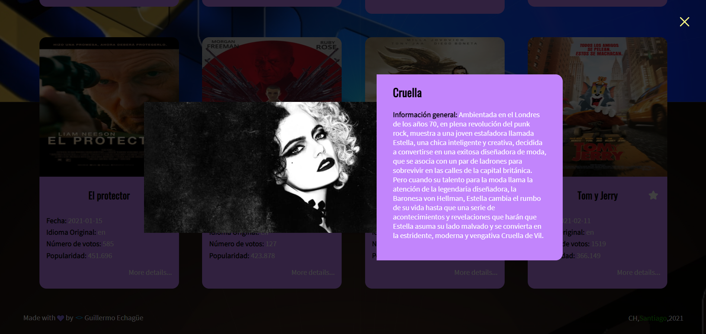
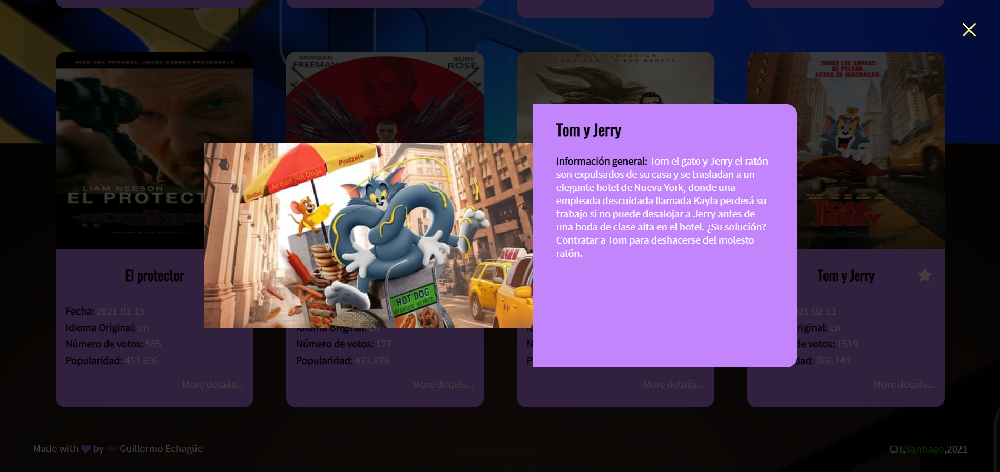
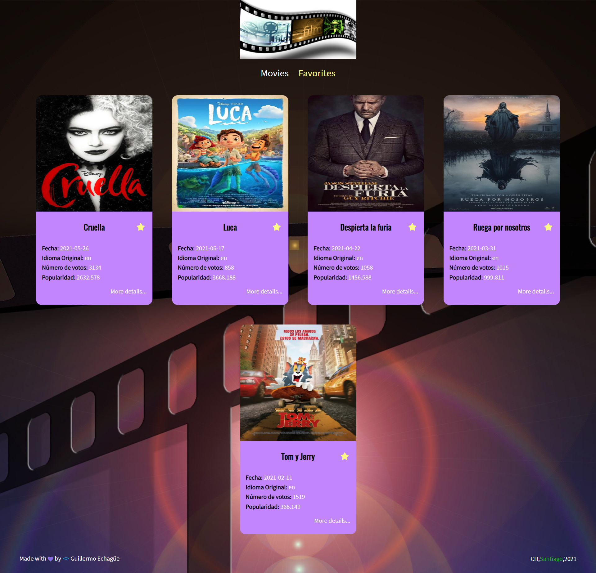

 webpack configuration and deploy vercel finished
 good practices with code splitting, webpack configuration and babel
 page favorites completed + custom hooks


## Instrucciones proyecto final
```bash

Respecto al proyecto final como ha sido en las últimas ediciones, es libre, por tanto, la idea que ustedes lleven a cabo algo que les guste. 
Tienen 2 opciones, pueden consumir algún API utilizando las formas ya vistas: api context + hooks o redux + hooks, como a ustedes les acomode mas.

Se evaluará:

1) Conexión y consumo de apis. Las llamadas pueden ser con fetch o axios
2) Creación de rutas + lazy loading el proyecto
3) Readme con la explicación y especificaciones del proyecto
4) Arquitectura limpia basada en patrones de arquitecturas vistos en el curso y buenas prácticas con Code Splitting
5) Implementación de página not found 404
6) Aplicar el uso de hooks
7) Creación de algún custom hook
8) Utilización de Prop-Types en por lo menos 3 componentes
9) Empaquetado de recursos a producción con Webpack y Babel
10) Despliegue en producción en Vercel
11) La UI la pueden implementar como mas les acomode
12) Investigar y aplicar el HOC de ErrorBoundary (límites de error) a su proyecto

Entregables:

1) Link del repositorio + link a producción
2) Nombre completo y rut

COMIENZO DE PROYECTO FINAL: LUNES 10 DE MAYO
FECHA DE ENTREGA: VIERNES 02 DE JUNIO HASTA LAS 00:00

```

## Dependencias del proyecto

```bash
# Axios
yarn add axios
# node-sass
yarn add node-sass@4.13.0
# prop-types
yarn add prop-types
# react-router-dom
yarn add react-router-dom
# redux
yarn add redux@4.0.4
# react-redux
yarn add react-redux
# redux-devtools-extension
yarn add redux-devtools-extension
# redux-logger
yarn add redux-logger
```

## Dependencias en producción del proyecto (Code Splitting)
```bash
yarn add @babel/core@7.12.17 -D
yarn add @babel/preset-env@7.12.17 -D
yarn add @babel/preset-react@7.12.13 -D
yarn add babel-loader@8.2.2 -D
yarn add @svgr/webpack@5.5.0 -D
yarn add copy-webpack-plugin@7.0.0 -D
yarn add core-js@3.9.0 -D
yarn add css-loader@5.0.2 -D
yarn add favicons-webpack-plugin@5.0.1 -D
yarn add file-loader@6.2.0 -D
yarn add html-webpack-plugin@5.2.0 -D
yarn add image-webpack-loader@7.0.1 -D
yarn add prettier@1.19.1 -D
yarn add regenerator-runtime@0.13.7 -D
yarn add sass-loader@11.0.1 -D
yarn add style-loader@2.0.0 -D
yarn add webpack@5.23.0 -D
yarn add webpack-cli@4.5.0 -D
yarn add webpack-dev-server@3.11.2 -D
```

## Proyecto en producción en Vercel

```bash
# Instalar CLI de vercel en forma Global (Una sola vez)
npm i -g vercel
# Configuraciones para el deploy
vercel
# Proyecto a Producción
vercel --prod
#Development: 
https://redux-movie-guillermoechague.vercel.app/
#Production: 
https://redux-movie-i4sla0qbb-guillermoechague.vercel.app/
```

## Ejecución de proyecto
```bash
# Modo Development
yarn start
# Modo Production
yarn build
# Servidor de prueba webpack
yarn run dev-server
```


## Codigos GIT
```bash
# Revisar logs
git log --pretty=oneline
#Cargar cambios y versiones
git branch -M main
git push -u origin main
# Generar Tags
           (Version) 
git tag -a V1.0.0 -m "Mensaje"
git push --tags
#branches (Ramas)
git add .
git checkout -b room
git commit -m "Agregado de dependencias"
git push origin room
#Unir Ramas a main
git checkout main
git merge <Nombre Rama> -m "Mensaje rama"
```

## Demostración del proyecto

### Error


### Películas


### Detalle Películas



### Películas Favoritas




### Vercel
